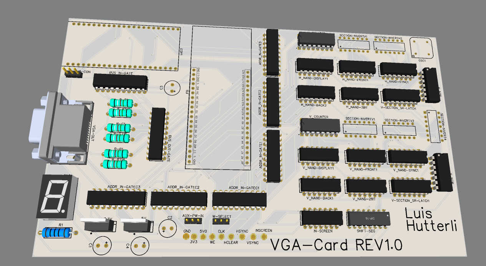

# VGA-Card

For my final year school project, I decided to build a simple graphics card.

This repo contains the source code for the control software and the device firmware.

## What does it look like?

Here you can see a sample render of one of my custom designed pcb's.

Unfortunately I was not able to bring this project to a stable point in time.
Currently the card and software only supports the transmission and displaying of a single image at a time.

The card is also not able to produce a stable and repeatable output (eg. images only show up very rarely)

## Improvements and self reflection
I would definitely not recommend doing this to anyone.

It was a very interesting project and I have to say, I definitely learned many new things.
But it's just to complicated and not possible in the given time.
